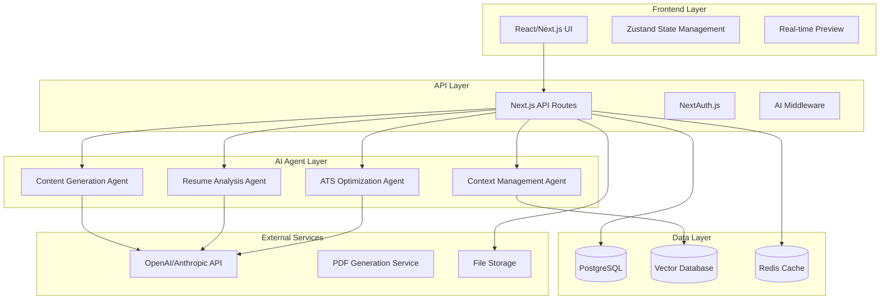

v# Design Document

## Overview

The AI-powered resume builder is a modern web application that provides an intuitive workflow for creating professional resumes using a single, intelligent template that adapts based on user content and AI agent recommendations. The system emphasizes real-time AI assistance, continuous analysis, and seamless context flow across user sessions.

The application follows a streamlined 4-step workflow: Add Content → AI Enhancement → Customize → Download, with AI agents providing continuous support throughout the process.

## ArchitectureV

### High-Level Architecture



### Technology Stack

**Frontend:**
- **Next.js 14** - Full-stack React framework with App Router
- **React 18** - UI library with concurrent features
- **TypeScript** - Type safety and developer experience
- **AG-UI** - Advanced UI components for data-rich applications
- **Tailwind CSS** - Utility-first CSS framework
- **Zustand** - Lightweight state management
- **React Hook Form** - Form handling with validation
- **Framer Motion** - Smooth animations and transitions

**Backend:**
- **Next.js API Routes** - Serverless API endpoints
- **NextAuth.js** - Authentication and session management
- **Prisma** - Type-safe database ORM
- **PostgreSQL** - Primary database for structured data
- **Redis** - Caching and session storage
- **Pinecone/Chroma** - Vector database for context storage

**AI Integration:**
- **OpenAI GPT-4** - Primary LLM for content generation
- **Anthropic Claude** - Backup LLM for analysis tasks
- **LangChain** - AI agent orchestration and chaining
- **Vercel AI SDK** - Streaming AI responses

**Infrastructure:**
- **Vercel** - Deployment and hosting platform
- **Supabase** - PostgreSQL hosting and real-time features
- **Upstash Redis** - Serverless Redis for caching

## Components and Interfaces

### Core Components

#### 1. Resume Builder Interface
```typescript
interface ResumeBuilderProps {
  resumeId?: string;
  initialData?: ResumeData;
  onSave: (data: ResumeData) => Promise<void>;
  onAnalyze: (data: ResumeData) => Promise<AnalysisResult>;
}

interface ResumeData {
  id: string;
  userId: string;
  personalInfo: PersonalInfo;
  sections: ResumeSection[];
  template: TemplateConfig;
  metadata: ResumeMetadata;
  createdAt: Date;
  updatedAt: Date;
}
```

#### 2. AI Agent Interfaces
```typescript
interface ContentGenerationAgent {
  generateSuggestions(context: UserContext, section: string): Promise<ContentSuggestion[]>;
  enhanceContent(content: string, context: UserContext): Promise<string>;
  generateBulletPoints(jobTitle: string, company: string): Promise<string[]>;
}

interface AnalysisAgent {
  analyzeResume(resume: ResumeData): Promise<AnalysisResult>;
  scoreResume(resume: ResumeData): Promise<ResumeScore>;
  checkATSCompatibility(resume: ResumeData): Promise<ATSResult>;
}

interface ContextAgent {
  buildUserContext(userId: string): Promise<UserContext>;
  updateContext(userId: string, interaction: UserInteraction): Promise<void>;
  getPersonalizedSuggestions(context: UserContext): Promise<Suggestion[]>;
}
```

#### 3. Template System
```typescript
interface AdaptiveTemplate {
  id: string;
  name: string;
  layout: LayoutConfig;
  styling: StyleConfig;
  adaptationRules: AdaptationRule[];
}

interface AdaptationRule {
  condition: (resume: ResumeData) => boolean;
  modifications: TemplateModification[];
}

interface TemplateModification {
  type: 'layout' | 'styling' | 'sections';
  changes: Record<string, any>;
}
```

### API Endpoints

#### Resume Management
- `POST /api/resumes` - Create new resume
- `GET /api/resumes/:id` - Get resume by ID
- `PUT /api/resumes/:id` - Update resume
- `DELETE /api/resumes/:id` - Delete resume
- `POST /api/resumes/:id/duplicate` - Duplicate resume

#### AI Services
- `POST /api/ai/content/generate` - Generate content suggestions
- `POST /api/ai/content/enhance` - Enhance existing content
- `POST /api/ai/analyze` - Analyze resume quality
- `POST /api/ai/optimize` - ATS optimization suggestions
- `POST /api/ai/context/update` - Update user context

#### Document Services
- `POST /api/documents/pdf` - Generate PDF
- `POST /api/documents/word` - Generate Word document
- `POST /api/documents/parse` - Parse uploaded resume

## Data Models

### Database Schema

```sql
-- Users table
CREATE TABLE users (
  id UUID PRIMARY KEY DEFAULT gen_random_uuid(),
  email VARCHAR(255) UNIQUE NOT NULL,
  name VARCHAR(255),
  created_at TIMESTAMP DEFAULT NOW(),
  updated_at TIMESTAMP DEFAULT NOW()
);

-- Resumes table
CREATE TABLE resumes (
  id UUID PRIMARY KEY DEFAULT gen_random_uuid(),
  user_id UUID REFERENCES users(id) ON DELETE CASCADE,
  title VARCHAR(255) NOT NULL,
  data JSONB NOT NULL,
  template_config JSONB NOT NULL,
  metadata JSONB DEFAULT '{}',
  created_at TIMESTAMP DEFAULT NOW(),
  updated_at TIMESTAMP DEFAULT NOW()
);

-- User contexts table
CREATE TABLE user_contexts (
  id UUID PRIMARY KEY DEFAULT gen_random_uuid(),
  user_id UUID REFERENCES users(id) ON DELETE CASCADE,
  context_data JSONB NOT NULL,
  embedding VECTOR(1536),
  updated_at TIMESTAMP DEFAULT NOW()
);

-- Resume analysis table
CREATE TABLE resume_analyses (
  id UUID PRIMARY KEY DEFAULT gen_random_uuid(),
  resume_id UUID REFERENCES resumes(id) ON DELETE CASCADE,
  score INTEGER NOT NULL,
  analysis_data JSONB NOT NULL,
  created_at TIMESTAMP DEFAULT NOW()
);
```

### Context Data Structure

```typescript
interface UserContext {
  userId: string;
  profile: {
    industry: string;
    experienceLevel: 'entry' | 'mid' | 'senior' | 'executive';
    targetRoles: string[];
    skills: string[];
    careerGoals: string[];
  };
  preferences: {
    writingStyle: 'formal' | 'casual' | 'technical';
    contentLength: 'concise' | 'detailed';
    focusAreas: string[];
  };
  history: {
    interactions: UserInteraction[];
    feedbackPatterns: FeedbackPattern[];
    improvementAreas: string[];
  };
  embedding: number[];
}
```

## Error Handling

### Error Types and Handling Strategy

```typescript
enum ErrorType {
  VALIDATION_ERROR = 'VALIDATION_ERROR',
  AI_SERVICE_ERROR = 'AI_SERVICE_ERROR',
  DATABASE_ERROR = 'DATABASE_ERROR',
  AUTHENTICATION_ERROR = 'AUTHENTICATION_ERROR',
  RATE_LIMIT_ERROR = 'RATE_LIMIT_ERROR'
}

interface AppError {
  type: ErrorType;
  message: string;
  details?: Record<string, any>;
  retryable: boolean;
}
```

### Error Handling Patterns

1. **AI Service Failures**: Implement fallback mechanisms and graceful degradation
2. **Database Errors**: Use connection pooling and retry logic with exponential backoff
3. **Validation Errors**: Provide clear, actionable error messages to users
4. **Rate Limiting**: Implement queue system for AI requests with user feedback
5. **Network Errors**: Offline-first approach with local storage and sync

## Testing Strategy

### Testing Pyramid

#### Unit Tests (70%)
- **AI Agent Logic**: Test content generation, analysis algorithms
- **Template Adaptation**: Test template modification rules
- **Data Validation**: Test input validation and sanitization
- **Utility Functions**: Test helper functions and transformations

#### Integration Tests (20%)
- **API Endpoints**: Test API routes with database interactions
- **AI Service Integration**: Test LLM API integrations with mocked responses
- **Database Operations**: Test complex queries and transactions
- **Authentication Flow**: Test NextAuth.js integration

#### End-to-End Tests (10%)
- **Resume Creation Flow**: Test complete user journey
- **AI Enhancement Process**: Test AI suggestions and improvements
- **Document Generation**: Test PDF/Word export functionality
- **Context Persistence**: Test context flow across sessions

### Testing Tools
- **Jest** - Unit and integration testing
- **React Testing Library** - Component testing
- **Playwright** - End-to-end testing
- **MSW** - API mocking for tests
- **Prisma Test Environment** - Database testing setup

### AI Testing Strategy
- **Deterministic Testing**: Use fixed prompts and expected outputs
- **Regression Testing**: Track AI output quality over time
- **A/B Testing**: Compare different AI approaches
- **Human Evaluation**: Regular review of AI-generated content quality